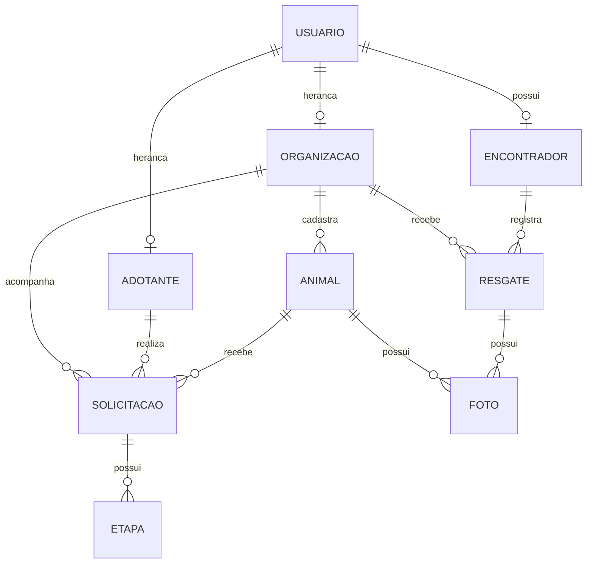

# Diagrama do Banco de Dados — Adote+

```mermaid
erDiagram
    USUARIO ||--o| ADOTANTE : heranca
    USUARIO ||--o| ORGANIZACAO : heranca
    USUARIO ||--o| ENCONTRADOR : possui
    ORGANIZACAO ||--o{ ANIMAL : cadastra
    ORGANIZACAO ||--o{ RESGATE : recebe
    ORGANIZACAO ||--o{ SOLICITACAO : acompanha
    ADOTANTE ||--o{ SOLICITACAO : realiza
    ANIMAL ||--o{ SOLICITACAO : recebe
    ANIMAL ||--o{ FOTO : possui
    ENCONTRADOR ||--o{ RESGATE : registra
    RESGATE ||--o{ FOTO : possui
    SOLICITACAO ||--o{ ETAPA : possui
```

## Entidades

- Usuario
- Adotante
- Organizacao
- Encontrador
- Animal
- Solicitacao
- Resgate
- Etapa
- Foto
